<p align="center">
  
</p>

<h1 align="center">
  
</h1>

<!-- Typing SVG Roles -->
<p align="center">
  <a href="https://git.io/typing-svg">
    
  </a>
</p>

<!-- Social Badges -->
<p align="center">
  <a href="https://jwmardi.com/">
    
  </a>
  <a href="https://github.com/Brago475">
    
  </a>
  <a href="https://www.linkedin.com/in/jamesmardi">
    
  </a>
</p>

<!-- Animated GIF -->
<p align="center">
  
</p>

<!-- About Me -->
<h2>About Me</h2>

```yaml
name: James W Mardi
alias: BRAGO475
location: New Jersey, USA
education:
  - MS in Computer Science @ Kean University (Expected 2027)
  - BS in Computer Science & Information Systems (GPA: 3.4)
current_role: Tech Support @ Kean
interests: ["Full Stack Dev", "AI/ML", "Adversarial AI Research", "Open Source"]
fun_fact: "I ship, learn, and share -- one commit at a time"
```

<!-- Wave Divider -->


<!-- Tech Stack -->
<h2>Tech Arsenal</h2>

<details>
<summary><b>Languages -- click to expand</b></summary>
<br/>


</details>

<details>
<summary><b>Frameworks & Libraries -- click to expand</b></summary>
<br/>


</details>

<details>
<summary><b>AI / ML -- click to expand</b></summary>
<br/>


</details>

<details>
<summary><b>Tools -- click to expand</b></summary>
<br/>


</details>

<!-- Wave Divider -->


<!-- Featured Projects -->
<h2>Featured Projects</h2>

<table>
  <tr>
    <td width="50%" valign="top">
      <h3 align="center">Timely</h3>
      <p align="center">
        <a href="https://github.com/AquaticNebulae/TimelyProject">
          
        </a>
      </p>
      <p><b>Real Estate & Professional Services Platform</b></p>
      <p>Role-based platform supporting admins, consultants, and clients. Features project tracking, document workflows, time logging, and audit logging.</p>
      <p>
        
        
        
        
        
      </p>
    </td>
    <td width="50%" valign="top">
      <h3 align="center">Bloom</h3>
      <p align="center">
        <a href="https://github.com/Brago475/Bloom">
          
        </a>
      </p>
      <p><b>Social Media Platform</b></p>
      <p>Full-featured social media platform with REST APIs, normalized SQL schemas, secure authentication, and dynamic content rendering -- designed for 500+ DAUs.</p>
      <p>
        
        
        
        
      </p>
    </td>
  </tr>
  <tr>
    <td width="50%" valign="top">
      <h3 align="center">Employee Manager System</h3>
      <p align="center">
        <a href="https://github.com/Brago475/Employee-Manager-Systems">
          
        </a>
      </p>
      <p><b>CRUD Management Tool</b></p>
      <p>Employee management system with full CRUD operations, role handling, data validation, and relational database schemas for data integrity.</p>
      <p>
        
        
      </p>
    </td>
    <td width="50%" valign="top">
      <h3 align="center">AI Security Research</h3>
      <p align="center">
        
      </p>
      <p><b>Adversarial Testing of LLMs</b></p>
      <p>Conducted adversarial testing on ChatGPT & Gemini with 50+ crafted prompts. Evaluated robustness, bias, and prompt-injection vulnerabilities using PyTorch ML pipelines on 10K+ sample datasets.</p>
      <p>
        
        
      </p>
    </td>
  </tr>
</table>

<!-- Wave Divider -->


<!-- Experience Timeline -->
<h2>Experience</h2>

<div align="center">

```
╔══════════════════════════════════════════════════════════════════════════╗
║                            MY JOURNEY SO FAR                             ║
╠══════════════════════════════════════════════════════════════════════════╣
║                                                                          ║
║  [SWE INTERN] Office of Science & Technology    Sep 2025 -> Dec 2025     ║
║  |                                                                       ║
║  |  > Built Python OCR pipeline: 100+ PDFs -> Excel (90% accuracy)      ║
║  |  > Automated data cleaning -- cut manual work by 70%                 ║
║  |  > Adaptive parsing for messy document layouts                       ║
║  |                                                                       ║
║  [RESEARCHER] Kean University                   Nov 2024 -> Sep 2025     ║
║  |                                                                       ║
║  |  > Adversarial testing on ChatGPT & Gemini (50+ prompts)            ║
║  |  > PyTorch ML pipelines on 10K+ sample datasets                     ║
║  |  > Evaluated LLM robustness, bias & prompt-injection vulns          ║
║  |                                                                       ║
║  [TECH SUPPORT] Kean University                 Sep 2024 -> Present      ║
║  |                                                                       ║
║  |  > Resolve 20-30 issues/week (OS, hardware, software)               ║
║  |  > Maintain & configure 30+ lab workstations                        ║
║  |  > Software installs, troubleshooting & optimization                ║
║  |                                                                       ║
║  [BS IN CS & IS] Kean University                Sep 2021 -> Dec 2025     ║
║  |                                                                       ║
║  |  > GPA: 3.4                                                         ║
║  |  > Coursework: OS, DSA, Databases, Software Engineering             ║
║  |                                                                       ║
║  V                                                                       ║
║  [NEXT] MS in Computer Science -- Kean U.       Expected 2027            ║
║                                                                          ║
╚══════════════════════════════════════════════════════════════════════════╝
```

</div>

<!-- Wave Divider -->


<!-- GitHub Trophies -->
<h2>GitHub Trophies</h2>

<p align="center">
  <a href="https://github.com/ryo-ma/github-profile-trophy">
    
  </a>
</p>

<!-- Wave Divider -->


<h2>GitHub Stats</h2>

<!-- STATS + TOP LANGUAGES -->
<!-- These SVGs live i and update daily at 3 AM UTC -->
<p align="center">
  
  
</p>

<!-- Profile Summary Cards (API-based but very reliable) -->
<p align="center">
  
  
</p>

<p align="center">
  
  
</p>

<p align="center">
  
</p>

<!-- Streak Stats -->
<p align="center">
  <a href="https://git.io/streak-stats">
    
  </a>
</p>

<!-- Activity Graph -->
<p align="center">
  <a href="https://github.com/Ashutosh00710/github-readme-activity-graph">
    
  </a>
</p>

<!-- Contribution Snake -->
<h2>Watch the Snake Eat My Contributions</h2>

<p align="center">
  <picture>
    <source media="(prefers-color-scheme: dark)" srcset="https://github.com/Brago475/Brago475/blob/output/github-snake-dark.svg" />
    <source media="(prefers-color-scheme: light)" srcset="https://github.com/Brago475/Brago475/blob/output/github-snake.svg" />
    
  </picture>
</p>

<!-- Profile Views Counter -->
<p align="center">
  
</p>

<p align="center">
  
</p>

<h3 align="center">
  
</h3>
