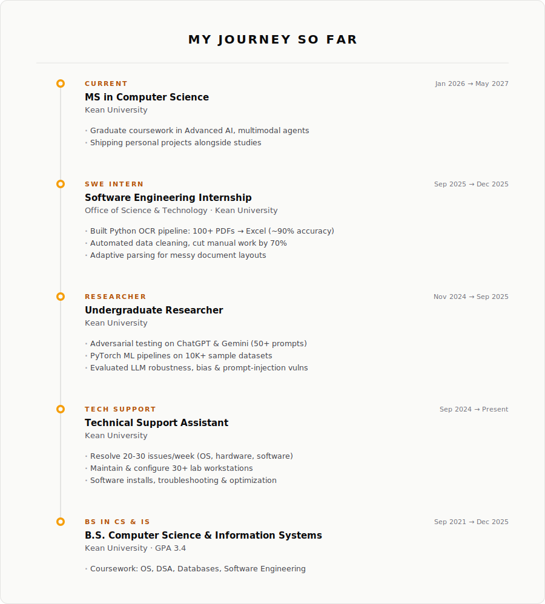

<p align="center">
  
</p>

<h1 align="center">
  
</h1>

<!-- Typing SVG Roles -->
<p align="center">
  <a href="https://git.io/typing-svg">
    
  </a>
</p>

<!-- Social Badges -->
<p align="center">
  <a href="https://jwmardi.com/"></a>&nbsp;<a href="https://github.com/Brago475"></a>&nbsp;<a href="https://www.linkedin.com/in/jamesmardi"></a>
</p>

<!-- Animated GIF -->
<p align="center">
  
</p>

<!-- About Me -->
<h2>About Me</h2>

```yaml
name: James W Mardi
alias: BRAGO475
location: New Jersey, USA
education:
  - MS in Computer Science @ Kean University (Expected May 2027)
  - BS in Computer Science & Information Systems (GPA: 3.4, Dec 2025)
current_role: Technical Support Assistant @ Kean University
homelab: "J-Network (6U rack, Proxmox, Pi-hole, Docker fleet)"
languages: ["English", "Spanish", "French"]
interests:
  - Full Stack Development
  - AI / ML & Multimodal Agents
  - Systems Programming & OS Dev
  - Self-hosting & Homelab
  - Security & Privacy
motto: "Ship, learn, share -- one commit at a time"
```

<!-- Divider -->


<!-- Tech Stack -->
<h2>Tech Arsenal</h2>

<h3 align="center">Languages</h3>
<table align="center">
  <tr>
    <td align="center" width="110"><a href="https://www.python.org/"></a><br/><sub><b>Python</b></sub></td>
    <td align="center" width="110"><a href="https://www.typescriptlang.org/"></a><br/><sub><b>TypeScript</b></sub></td>
    <td align="center" width="110"><a href="https://developer.mozilla.org/en-US/docs/Web/JavaScript"></a><br/><sub><b>JavaScript</b></sub></td>
    <td align="center" width="110"><a href="https://learn.microsoft.com/en-us/dotnet/csharp/"></a><br/><sub><b>C#</b></sub></td>
    <td align="center" width="110"><a href="https://en.cppreference.com/w/c"></a><br/><sub><b>C</b></sub></td>
  </tr>
  <tr>
    <td align="center" width="110"><a href="https://www.nasm.us/"></a><br/><sub><b>Assembly</b></sub></td>
    <td align="center" width="110"><a href="https://www.php.net/"></a><br/><sub><b>PHP</b></sub></td>
    <td align="center" width="110"><a href="https://www.java.com/"></a><br/><sub><b>Java</b></sub></td>
    <td align="center" width="110"><a href="https://www.gnu.org/software/bash/"></a><br/><sub><b>Bash</b></sub></td>
    <td align="center" width="110"><a href="https://www.postgresql.org/"></a><br/><sub><b>SQL</b></sub></td>
  </tr>
</table>

<h3 align="center">Frameworks & Libraries</h3>
<table align="center">
  <tr>
    <td align="center" width="110"><a href="https://react.dev/"></a><br/><sub><b>React</b></sub></td>
    <td align="center" width="110"><a href="https://dotnet.microsoft.com/"></a><br/><sub><b>.NET 8</b></sub></td>
    <td align="center" width="110"><a href="https://vite.dev/"></a><br/><sub><b>Vite</b></sub></td>
    <td align="center" width="110"><a href="https://tailwindcss.com/"></a><br/><sub><b>Tailwind</b></sub></td>
  </tr>
  <tr>
    <td align="center" width="110"><a href="https://laravel.com/"></a><br/><sub><b>Laravel</b></sub></td>
    <td align="center" width="110"><a href="https://nodejs.org/"></a><br/><sub><b>Node.js</b></sub></td>
    <td align="center" width="110"><a href="https://www.djangoproject.com/"></a><br/><sub><b>Django</b></sub></td>
    <td align="center" width="110"><a href="https://expressjs.com/"></a><br/><sub><b>Express</b></sub></td>
  </tr>
</table>

<h3 align="center">AI / ML</h3>
<table align="center">
  <tr>
    <td align="center" width="110"><a href="https://pytorch.org/"></a><br/><sub><b>PyTorch</b></sub></td>
    <td align="center" width="110"><a href="https://huggingface.co/"></a><br/><sub><b>Hugging Face</b></sub></td>
    <td align="center" width="110"><a href="https://www.langchain.com/"></a><br/><sub><b>LangChain</b></sub></td>
    <td align="center" width="110"><a href="https://ollama.com/"></a><br/><sub><b>Ollama</b></sub></td>
    <td align="center" width="110"><a href="https://scikit-learn.org/"></a><br/><sub><b>scikit-learn</b></sub></td>
  </tr>
</table>

<h3 align="center">Infra & Tools</h3>
<table align="center">
  <tr>
    <td align="center" width="110"><a href="https://www.docker.com/"></a><br/><sub><b>Docker</b></sub></td>
    <td align="center" width="110"><a href="https://www.proxmox.com/"></a><br/><sub><b>Proxmox</b></sub></td>
    <td align="center" width="110"><a href="https://www.cloudflare.com/"></a><br/><sub><b>Cloudflare</b></sub></td>
    <td align="center" width="110"><a href="https://www.postgresql.org/"></a><br/><sub><b>PostgreSQL</b></sub></td>
  </tr>
  <tr>
    <td align="center" width="110"><a href="https://www.linux.org/"></a><br/><sub><b>Linux</b></sub></td>
    <td align="center" width="110"><a href="https://git-scm.com/"></a><br/><sub><b>Git</b></sub></td>
    <td align="center" width="110"><a href="https://www.nginx.com/"></a><br/><sub><b>NGINX</b></sub></td>
    <td align="center" width="110"><a href="https://code.visualstudio.com/"></a><br/><sub><b>VS Code</b></sub></td>
  </tr>
</table>

<!-- Divider -->


<!-- Featured Projects -->
<h2>Featured Projects</h2>

<table>
  <tr>
    <td width="50%" valign="top">
      <h3 align="center">FORGED</h3>
      <p align="center">
        <a href="https://forgedgyms.com">
          
        </a>
        <a href="https://github.com/Brago475/FORGED">
          
        </a>
      </p>
      <p><b>Containerized Full-Stack Fitness Tracker</b></p>
      <p>Self-hosted fitness platform with workouts, nutrition, measurements, and weekly recaps. Deployed via Cloudflare Tunnel on a Proxmox Ubuntu VM. Built under the FORGE UI design system: borderless, premium, minimal.</p>
      <p>
        
        
        
        
        
      </p>
    </td>
    <td width="50%" valign="top">
      <h3 align="center">MyMisu OS</h3>
      <p align="center">
        <a href="https://github.com/Brago475/myMisu_OS">
          
        </a>
      </p>
      <p><b>Bare-Metal x86 Operating System (v1.0.0)</b></p>
      <p>~3,000 LOC in C and Assembly. Ships with 35+ shell commands, ramdisk filesystem, process management, memory allocator, 5 syscalls via int 0x80, text editor, and 7 games. Boots on real hardware via GRUB Multiboot.</p>
      <p>
        
        
        
        
      </p>
    </td>
  </tr>
  <tr>
    <td width="50%" valign="top">
      <h3 align="center">Timely</h3>
      <p align="center">
        <a href="https://github.com/AquaticNebulae/TimelyProject">
          
        </a>
      </p>
      <p><b>Real Estate & Professional Services Platform</b></p>
      <p>Role-based platform supporting admins, consultants, and clients. Features project tracking, document workflows, hours logging, messaging, reports, and audit logs. Targeting PostgreSQL + Docker deployment on timelyre.com.</p>
      <p>
        
        
        
        
        
      </p>
    </td>
    <td width="50%" valign="top">
      <h3 align="center">AIEducator</h3>
      <p align="center">
        <a href="https://aieducator.jamesmardi475.workers.dev">
          
        </a>
        <a href="https://github.com/Brago475/AIEducator">
          
        </a>
      </p>
      <p><b>AI-Powered Career Fair Pre-Matching Tool</b></p>
      <p>Matches students to employers before career fairs using LLM-driven evaluation. Built with Groq's free inference API (llama-3.3-70b-versatile), deployed to Cloudflare Pages straight from GitHub.</p>
      <p>
        
        
        
        
      </p>
    </td>
  </tr>
</table>

<!-- Divider -->


<!-- Live Feed -->
<h2>Live Feed</h2>

<p align="center">
  
</p>

<!-- Divider -->


<!-- Experience Timeline -->
<h2>Experience</h2>

<p align="center">
  
</p>

<!-- Divider -->


<!-- GitHub Trophies -->
<h2>GitHub Trophies</h2>

<p align="center">
  <a href="https://github.com/ryo-ma/github-profile-trophy">
    
  </a>
</p>

<!-- Divider -->


<h2>GitHub Stats</h2>

<!-- STATS + TOP LANGUAGES -->
<p align="center">
  
  
</p>

<!-- Profile Summary Cards -->
<p align="center">
  
  
</p>

<p align="center">
  
  
</p>

<p align="center">
  
</p>

<!-- Streak Stats -->
<p align="center">
  <a href="https://git.io/streak-stats">
    
  </a>
</p>

<!-- Activity Graph -->
<p align="center">
  <a href="https://github.com/Ashutosh00710/github-readme-activity-graph">
    
  </a>
</p>

<!-- Divider -->


<!-- Quote + Joke Side by Side -->
<table align="center" width="100%">
  <tr>
    <td width="50%" align="center">
      <h3>Dev Quote of the Day</h3>
      <a href="https://github.com/PiyushSuthar/github-readme-quotes">
        
      </a>
    </td>
    <td width="50%" align="center">
      <h3>Random Dev Joke</h3>
      <a href="https://github.com/ABSphreak/readme-jokes">
        
      </a>
    </td>
  </tr>
</table>

<!-- Contribution Snake -->
<h2>Watch the Snake Eat My Contributions</h2>

<p align="center">
  <picture>
    <source media="(prefers-color-scheme: dark)" srcset="https://github.com/Brago475/Brago475/blob/output/github-snake-dark.svg" />
    <source media="(prefers-color-scheme: light)" srcset="https://github.com/Brago475/Brago475/blob/output/github-snake.svg" />
    
  </picture>
</p>

<!-- Profile Views Counter -->
<p align="center">
  
</p>

<p align="center">
  
</p>

<h3 align="center">
  
</h3>
